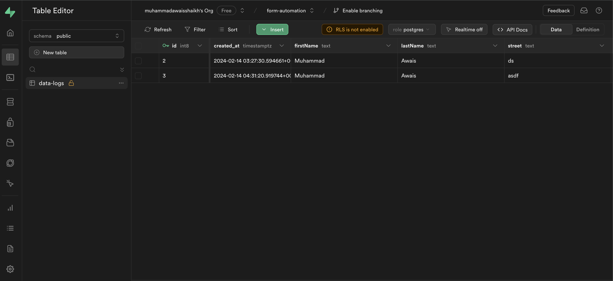

## POC for Automated Form Submission 🤖

POC for Automated Form Submission 🤖 Leveraging VueJS and Python (Flask, Selenium), along with seamless submission log storage in Supabase we've achieved efficient automation 💻

## Frontend - VueJS

### Data collection form: 
When submitted, it sends the form data to a server-side endpoint (Python Script) using Axios. Additionally, it inserts the form data into a Supabase Database for data logging purposes. It provides feedback to the user via alerts and console logs on errors if any coming from Python Script.

### From Submissions:
This component fetches data from a Supabase Database named 'data-logs' when the component is mounted and displays the fetched data in a table format. It provides a simple and efficient way to retrieve and present data from a Supabase database for every submission users made in a Vue.js application.

### TestForm01:
This Component is for testing and it Automates the form submission using python Selenium, when user submits the form using "Data collection form" we are sending all data to pyhton endpoint built with Flask to receive the data coming from vue Frontend App. and then Python script is opening "TestForm01" component and automatically fills and submits the data came from Python API response.

## Backend - Python, Flask, Selenium

### execute_form_data.py
This Python script sets up a Flask server that listens for POST requests on the '/execute' endpoint. When it receives a POST request, it extracts the JSON payload from the request and passes it to the process_data function imported from the script_to_run module. The process_data function is expected to handle the processing of the received data, possibly filling automated forms or performing other tasks.

### script_to_run.py
This Python script defines a function process_data that utilizes Selenium to fill out a form with data provided as input and then submits the form automatically.

### POSTMAN - CURL
CURL for Automated Form Filling Execution (Python, Flask, Selenium), You can send the payload and it automatically open test form and submits the data and you can see the logs in table

curl --location 'http://127.0.0.1:5000/execute' \
--header 'Content-Type: application/json' \
--data '{
    "firstName": "awais",
    "lastName": "hola",
    "street": "sample street",
    "housenr": "A-45",
    "zipcode": "78998",
    "city": "Hamburg"
}'

### Database - SUPABASE
Supabase Database named 'data-logs for storing the data as callback when consuming python BE scripts

